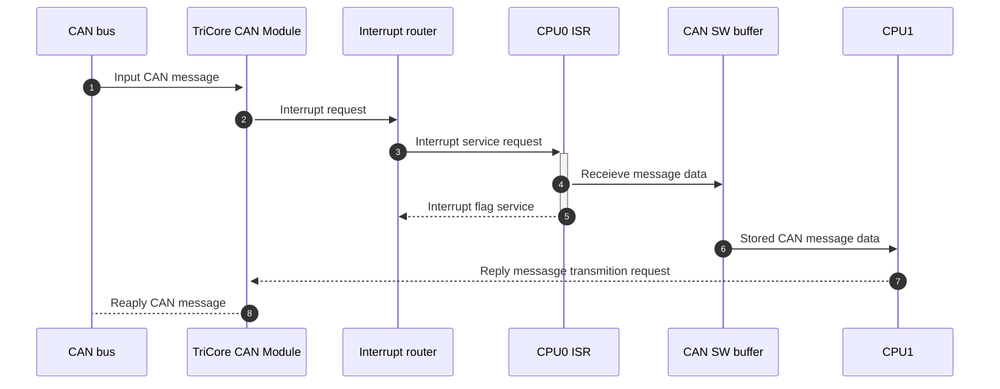

# ERIKA RTOS CAN multi-core example for TriCore TC387xQP

## Overview

This ADS (AURIX Development Studio) project provides user with an example of configuration for CAN using TriCore TC387QP microcontroler. Configuration is done using the iLLD driver set together with ERIKA RTOS. This example is provides the user with extended CAN configuration example that covers more advanced topics such a multi-core proecssing, HW filtering, SW buffer and spinlocks.

This example from "black box" point of view copies [single-core example](https://github.com/Darth-Bujar/examples_erika/tree/develop/can_singlecore). The difference, is in usage of two cores instead of one. First core (CPU 0) managing all interrupts and CAN module initialization and writes new messages to SW CAN buffer. Second core (CPU 1) managing replying process for every message that is stored in SW CAN buffer by CPU0. The sequence diagram below show how the CAN message propagate thru the controller hardware and software. Let`s discuss each step


  

### Debug console prints

This functionality is coppied without any changes from [single-core example](https://github.com/Darth-Bujar/examples_erika/tree/develop/can_singlecore).

  

## Code Description

Main configuration file for ERIKA RTOS is conf.oil. Files C module can_control implementing the set of function for the application to work with CAN. Source files cpu0_appl.c and cpu1_appl.c are implementing tasks, previously defined in conf.oil, for CPU 0 and CPU 1

  

### Tasks

Example this time has two tasks. We will not discuss the definition of task_keep_alive_cpu0 since it has jsut two parametrs and nothing new in comparaison to previous examples.

  
  

However second task, is running on a diffrent core (CPU 1) and get periodically called by an alarm. When task get called it checks for the spinlock that controller the acces to SW buffer of CAN messages. If lock is aquired, then task reply to messages that re stored in SW buffer.

```xml

TASK task_can_tx_msg_processing_cpu1
{
	CPU_ID = 0x1;
	AUTOSTART = TRUE;
	SCHEDULE = FULL;
	ACTIVATION = 1;
	PRIORITY = 10;
	STACK = PRIVATE {
		SIZE = 256;
		};
};
```
```mermaid
sequenceDiagram 
autonumber 
ERIKA  RTOS  ->>+CPU1  Task: Activate the task via Alarm
loop  task_can_tx_msg_processing_cpu1
CPU1  Task->>CAN  SW  buffer: New messega data requesting
CAN  SW  buffer-->>CPU1  Task: New message
CPU1  Task->>+Tricore  CAN  module: Write reply message to TX Queue memmory
Tricore  CAN  module->>CAN  Bus: CAN Message
Tricore  CAN  module-->>CPU1  Task: Communication status
break  If  status  of  communcation  is  not  OK  exit  the  task
CPU1  Task-->>-ERIKA  RTOS: Deactivation of a task
end
end

box  can_control  module
participant  CAN  SW  buffer
participant  Tricore  CAN  module
end
```

#### CAN module initialization

Initialization proeccess remains almost the same. In comparasion to previous example filter configuration has been added. Filter will blocking the messages that has CAN ID in range from 0x01 to 0xAA. Filter can be se for standart and extended headers separatly but in this case they are set to the same values

```C++
// Filter setup
IfxCan_Filter filter;
filter.number = 0;
filter.elementConfiguration = IfxCan_FilterElementConfiguration_rejectId;
filter.type = IfxCan_FilterType_range;
filter.id1 = 0x02;
filter.id2 = 0xAA;

// Filter initialization
IfxCan_Can_setStandardFilter(&canNode, &filter);
IfxCan_Can_setExtendedFilter(&canNode, &filter);

```

  

### Interrupt Configuration

Program has 3 configured interrupts. One of them is the same interrupt for CAN RX new message event as it is done in [single-core example](https://github.com/Darth-Bujar/examples_erika/tree/develop/can_singlecore). Interrupts *can_isr_fifo0_msg_lost* and *can_isr_tx_success* are used to increase the assgiend counter of lost messages and transmitted messages. Theese coutner are then send with keep alive messag as 32 bit values.

```xml

ISR can_isr_fifo0_msg_lost {

	CPU_ID = 0x0;
	CATEGORY = 1;
	SOURCE = "CAN_CAN0_INT3";
	PRIORITY = 6;

};

ISR can_isr_tx_success {

	CPU_ID = 0x0;
	CATEGORY = 1;
	SOURCE = "CAN_CAN0_INT9";
	PRIORITY = 8;

};
```
### Keep alive message data diagram

  

|TODO|:

Here will be description of keep alive message format. Same Description will be added to single-core example

  

## Debug Output Example

```

CAN driver initialization: Complete
RX CAN ID: 0x154 data: 0xFF 0xFF 0xFF 0xFF 0xFF 0xFF 0xFF 0xFF
TX: Success
RX CAN ID: 0x152 data: 0xFF 0xFF 0xFF 0xFF 0xFF 0xFF 0xFF 0xFF
TX: Success

```