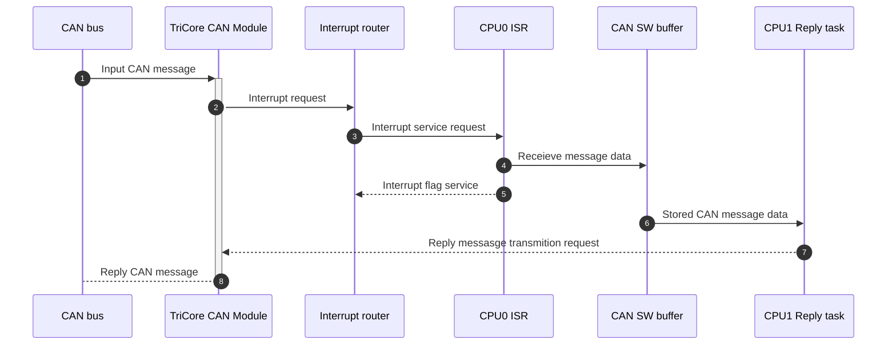

  
# ERIKA RTOS CAN multi-core example for TriCore TC387xQP
## Introduction
This project, developed in the AURIX Development Studio (ADS), serves as an educational example of CAN configuration using the TriCore TC387QP microcontroller. The configuration integrates the iLLD driver set with ERIKA RTOS. This example is an extension for a  [single-core example](https://github.com/Darth-Bujar/examples_erika/tree/develop/can_singlecore) CAN example that cover more advanced topics such as multi-core processing, hardware (HW) filtering, software (SW) buffering, and spinlocks. Familiarity with a single-core example and basic concepts outlined therein is assumed.

This example from "black box" point of view copies [single-core example](https://github.com/Darth-Bujar/examples_erika/tree/develop/can_singlecore), but with use the advantages of multicore MCU. First core (CPU 0) managing all interrupts, CAN module initialization and store recieved messages to SW CAN buffer. Second core (CPU 1) manage reply process. The sequence diagram below show how the CAN message propagate thru the controller hardware and software.
 **TODO: Revision of steps**



  

# Code Description

Main configuration file for ERIKA RTOS is conf.oil. Operations with CAN module is done by using set of pre-prepared functions in can_control C module. This module implements basic functions such as CAN initialization and, sending/recieving messages and also service functiuons for some of the interrupts. And also some of additional functions such as debug message evaluation, keep alive message and debug counters .

## ERIKA RTOS configuration

### Tasks and resources definition
In this example  configguration contain definition of two CPU (two cores). 
```C
    CPU_DATA = TRICORE 
    {
      ID = 0x0;
      CPU_CLOCK = 200.0;
      COMPILER = TASKING;
      IDLEHOOK = TRUE 
      {
        HOOKNAME = "idle_hook_core0";
      };
      
    };
    
    CPU_DATA = TRICORE 
    {
      ID = 0x1;
      MULTI_STACK = TRUE;
      IDLEHOOK = TRUE {
        HOOKNAME = "idle_hook_core1";
      };
    };
```
According to configuration above CPU is set to 200MHz frequency. Each of the CPU has its own idle hook implemnentation, however implementation of both function is the same and contain ony assembler _nop_ operation. 
Other resources that are defined in configuration files are the timers and alarms. Each CPU should have its own definition of Counter. Next code snipper contain an example configuration of _COUNTER_ and _ALARM_  for CPU0. Parametr _CYCLETIME_ of the alarm is set to 1000, which is together with parametr  _SECONDSPERTICK = 0.001_ in COUNTER definition lead to 1s alarm. Defintion of COUNTER and ALARM are the same for CPU1, but alarm is se to be triggered each 10ms
```C
  COUNTER system_timer_cpu0 
  {
    CPU_ID = 0x0;
    MINCYCLE = 1;
    MAXALLOWEDVALUE = 2147483647;
    TICKSPERBASE = 1;
    TYPE = HARDWARE {
        DEVICE = "STM_SR0";
        SYSTEM_TIMER = TRUE;
        PRIORITY = 2;
    };
    SECONDSPERTICK = 0.001;
  };
  
  ALARM keep_alive_alarm_cpu0_1s
  {
    COUNTER = system_timer_cpu0;
    ACTION = ACTIVATETASK { TASK = task_keep_alive_cpu0; };
    AUTOSTART = TRUE { ALARMTIME = 100; CYCLETIME = 1000; };
  };
```
Also configuration file contain a definition of two tasks. Each core has only one task. CPU0 has a task with a name task_keep_alive_cpu0. Task is triggered by an alarm each second. This task job is to sent so called _"keep alive"_ messages. This messages contain usefull debug information.  Farther information about keep alive messages can be found in capitol [Keep alive message](#keep-alive-message)
```C
  TASK task_keep_alive_cpu0 
  {
    CPU_ID = 0x0;
    PRIORITY = 1;
  };
```
Second core (CPU1) has another task assigned to it which is _task_can_tx_msg_processing_cpu1_. This task is triggered by an alarm on CPU 1 each 10ms. Task job is to service CAN SW buffer and reply to them (if there are any). 
```C
  TASK task_can_tx_msg_processing_cpu1 
  {
    CPU_ID = 0x1;
    AUTOSTART = TRUE;
    SCHEDULE = FULL;
    ACTIVATION = 1;
    PRIORITY = 10;
    STACK = PRIVATE {
      SIZE = 256;
    };
  };
```

### Interrupt Configuration
Exmaple has 3 configured interrupts. One of them, is the same interrupt for FIFO0 RX new message event as it is used in [single-core example](https://github.com/Darth-Bujar/examples_erika/tree/develop/can_singlecore). Additionaly Interrupts *can_isr_fifo0_msg_lost* and *can_isr_tx_success* are triggered each time on message lost event or succesfull transmittion event. Additionaly each interrupt increase apropriate counter on each service event Theese counter are then used as a data in [keep alive message](#keep-alive-message).
```C

ISR can_isr_fifo0_msg_lost {

	CPU_ID = 0x0;
	CATEGORY = 1;
	SOURCE = "CAN_CAN0_INT3";
	PRIORITY = 6;

};

ISR can_isr_tx_success {

	CPU_ID = 0x0;
	CATEGORY = 1;
	SOURCE = "CAN_CAN0_INT9";
	PRIORITY = 8;

};
```
This flowchart that shows how interrupts, task and alarms cooperate with eachother.
 **TODO: Convert to  (flowchart)**
```mermaid
sequenceDiagram 
autonumber 
ERIKA  RTOS  ->>+CPU1  Task: Activate the task via Alarm
CPU1  Task->>CAN  SW  buffer: New messega data requesting
CAN  SW  buffer-->>CPU1  Task: New message
CPU1  Task->>+Tricore  CAN  module: Write reply message to TX Queue memmory
Tricore  CAN  module->>CAN  Bus: CAN Message
Tricore  CAN  module-->>CPU1  Task: Communication status
CPU1  Task-->>-ERIKA  RTOS: Deactivation of a task
```

# Module can_control

## CAN initialization
Any information about HW registers can be found in [User Manual Part 1](https://www.infineon.com/dgdl/Infineon-AURIX_TC3xx_Part1-UserManual-v02_00-EN.pdf?fileId=5546d462712ef9b701717d3605221d96#page=728&zoom=100,56,128)  that containts SCU register description or [User Manual Part 2](https://www.infineon.com/dgdl/Infineon-AURIX_TC3xx_Part2-UserManual-v02_00-EN.pdf?fileId=5546d462712ef9b701717d35f8541d94#page=2009&zoom=100,56,725)  that contains CAN registers description.
Initialization proeccess remains almost the same as in [single-core example](https://github.com/Darth-Bujar/examples_erika/tree/develop/can_singlecore) CAN module is initialzied with a static configuratio in Configuration for CAN module is written as static variable and can be found in [can_control.c](https://github.com/Darth-Bujar/examples_erika/blob/dd456cfc07e43832dbc21f01195cf4f3e11f8e7e/can_multicore/ee/can_control.c#L48). Additional configuration step that is added in comparison to prvious example is HW filter configuration.
Filter will be configured to store the messages that is not in range from  0x02 to 0xAA. Any message that matches this range will be rejected (ignored) by a controller. Filter can be configured separatly for standart and extended CAN messge headers. But for simplification of example one configuration is used for both types of headers. The next code snippet illustrate how this configuration is done in a code
```C++
// Filter setup
IfxCan_Filter filter;
filter.number = 0; 
filter.elementConfiguration = IfxCan_FilterElementConfiguration_rejectId; //Rejection of matching frame
filter.type = IfxCan_FilterType_range; // Range of a filter is from id1 to id2 
filter.id1 = 0x02;
filter.id2 = 0xAA;

// Filter initialization
IfxCan_Can_setStandardFilter(&canNode, &filter);
IfxCan_Can_setExtendedFilter(&canNode, &filter);

```

# Keep alive and debug messages

## Keep alive message
This messages are sent periodically once per second with  ecah activation of a task_keep_alive_cpu0 (periodically triggered once per second by RTOS alarm). Data in the message represent number of recieved messages, number of lost messages and number of transmitted messages.
Data for this message are contained in structure _debug_info_. Each counter is incrememted when apropriated interrupt is triggered. 
```C
// Debug events counters
typedef  struct
{
	uint32  rx_counter; // RX FIFO0 New message interrupt (rxf0n)
	uint32  msg_lost;   // RX Message lost interrupt (alrt)
	uint32  tx_counter; // TX Successful Transmission (traco)
}debug_info;
```
Value of counters mentioned above is sent as a CAN message that contiant 12 bytes of data ( 32/8 * 3 bits)
Example of data frame:
<table>  
<tr>  
<th>CAN message header</th>  
<th>Bytes 0-3</th> 
<th>Bytes 4-7</th>  
<th>Bytes 8-11</th>  
</tr>  
<tr>  
<td>Default CAN ID is 111</td>  
<td>value of rx_counter</td>  
<td>value of msg_lost_conter</td> 
<td>value of tx_counter</td>  
</tr>  
</table>

## Debug message

This functionality is coppied without any changes from [single-core example](https://github.com/Darth-Bujar/examples_erika/tree/develop/can_singlecore).

## Debug Output Example
```txt
CAN driver initialization: Complete
RX CAN ID: 0x154 data: 0xFF 0xFF 0xFF 0xFF 0xFF 0xFF 0xFF 0xFF
TX: Success
RX CAN ID: 0x152 data: 0xFF 0xFF 0xFF 0xFF 0xFF 0xFF 0xFF 0xFF
TX: Success

```
# Soruces
1. [User Manual Part 1](https://www.infineon.com/dgdl/Infineon-AURIX_TC3xx_Part1-UserManual-v02_00-EN.pdf?fileId=5546d462712ef9b701717d3605221d96)
2. [User Manual Part 2](https://www.infineon.com/dgdl/Infineon-AURIX_TC3xx_Part2-UserManual-v02_00-EN.pdf?fileId=5546d462712ef9b701717d35f8541d94)
3. [ERIKA3 OIL specefication](https://www.erika-enterprise.com/wiki/index.php/ERIKA3_OIL_specification)
4. [ERIKA Enterprise Minimal API Manual](https://download.tuxfamily.org/erika/webdownload/manuals_pdf/ee_minimal_refman_1_1_3.pdf)
5. Documentation for iLLD can be built using Doxygen